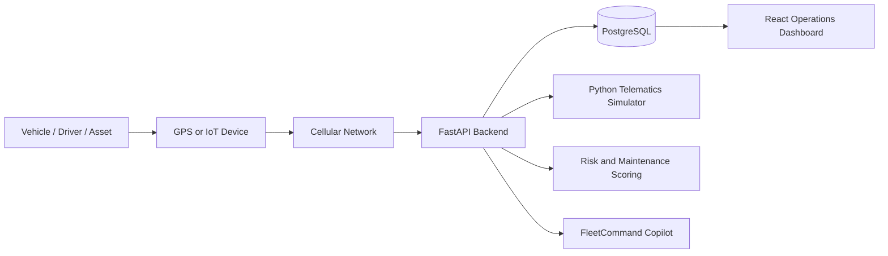

# FleetCommand: Intelligent Fleet & Asset Operations Platform

FleetCommand is a production-style full-stack SaaS platform for fleet, driver, route, asset, maintenance, alert, reporting, and telematics operations. It upgrades the original FleetIQ demo into a recruiter-ready command center inspired by enterprise fleet platforms such as Samsara, Motive, and Geotab.

## Why This Project Was Built

The project demonstrates how a real fleet operations product can combine live telematics, operational analytics, predictive maintenance, route intelligence, asset governance, and an LLM-ready assistant inside a modern full-stack application.

## Features

- Protected demo login and responsive SaaS app shell.
- Realistic dashboard with fleet health, utilization, fuel cost, alerts, maintenance, and risk KPIs.
- Real interactive maps: Mapbox when `VITE_MAPBOX_TOKEN` exists, Leaflet/OpenStreetMap fallback when it does not.
- Live vehicle tracking with friendly vehicle names, truck-style markers, search, status filters, sorting, and detail panels.
- Gradual speed simulation with road type, traffic condition, idle behavior, fuel burn, mileage, engine-hour updates, and generated alerts.
- Route intelligence with trip history, real map path display, completed and remaining route paths, stop markers, deviation status, and replay controls.
- Driver safety module with search, filtering, sortable risk fields, safety progress bars, trend charts, and coaching recommendations.
- Asset management with friendly asset names, warranty/audit state, searchable inventory, detail view, audit action, CSV export, and PDF placeholder.
- Predictive maintenance planner with vehicle-friendly names, filters, risk scoring, service history, schedule/complete/note actions, and CSV export.
- Grouped alerts with incident detail, recommended actions, audit trail, acknowledge, assign, resolve, and reopen actions.
- Executive reports with operational summary, date range, drill-down analytics, CSV export, and PDF placeholder.
- FleetCommand Copilot with fleet summary, recommendations, quick actions, Q&A, and explainability.
- System Monitoring & Telematics Center with clickable architecture components and live telemetry event stream.

## Documentation

- [Full Project Documentation](docs/PROJECT_DOCUMENTATION.md)
- [GitHub Pages Deployment Guide](docs/GITHUB_PAGES_DEPLOYMENT.md)

## Deployment Options

FleetCommand supports two useful deployment modes:

- **Docker full stack:** React + FastAPI + PostgreSQL for local development and full backend functionality.
- **GitHub Pages static demo:** React frontend only, using built-in realistic demo data so the portfolio site works without a server.

## Tech Stack

- Frontend: React, TypeScript, Tailwind CSS, Recharts, Mapbox GL, Leaflet/OpenStreetMap, Lucide icons
- Backend: FastAPI, SQLAlchemy, Pydantic
- Database: PostgreSQL
- ML/Analytics: Python, scikit-learn, NumPy
- DevOps: Docker, Docker Compose, GitHub Actions

## Architecture



## How Vehicle Monitoring Works

Demo simulator:

`Python simulator -> FastAPI endpoint -> PostgreSQL -> React dashboard`

The simulator generates GPS position, speed, target speed behavior, fuel percentage, odometer, engine hours, idle time, harsh braking, rapid acceleration, overspeeding, maintenance indicators, GPS accuracy, signal strength, and alert events.

Real-world telematics:

`Vehicle IoT device -> cellular network -> backend API -> database -> analytics engine -> live dashboard`

In a production deployment, GPS/engine devices would publish data through cellular networks or vendor APIs. FleetCommand is structured so those data sources can replace the local simulator.

## Local Setup With Docker

```bash
cd outputs/fleetiq
docker compose down
docker compose up --build
```

Open:

- Frontend: http://localhost:5173
- Backend API: http://localhost:8000
- API docs: http://localhost:8000/docs

Use **Demo user login**.

## GitHub Pages Setup

This repository includes `.github/workflows/deploy-pages.yml`.

1. Push the project to a GitHub repository.
2. In GitHub, open **Settings > Pages**.
3. Set **Build and deployment** to **GitHub Actions**.
4. Push to `main`.

The workflow builds the frontend with:

```bash
VITE_DEMO_MODE=true
```

That makes the deployed Pages site fully interactive using static in-browser demo data. The full-stack Docker version remains available for FastAPI and PostgreSQL.

If you want to reseed the database from scratch:

```bash
docker compose down -v
docker compose up --build
```

## Environment Variables

Frontend:

```bash
VITE_API_URL=http://localhost:8000
VITE_MAPBOX_TOKEN=
```

Backend:

```bash
DATABASE_URL=postgresql+psycopg://fleetiq:fleetiq@db:5432/fleetiq
OPENAI_API_KEY=
```

If no Mapbox token is provided, the app automatically uses Leaflet/OpenStreetMap.

## API Endpoints

Vehicles:
- `GET /vehicles`
- `GET /vehicles/{id}`
- `GET /vehicles/live`
- `PATCH /vehicles/{id}`

Drivers:
- `GET /drivers`
- `GET /drivers/{id}`

Routes:
- `GET /routes`
- `GET /routes/{trip_id}`
- `GET /routes/{trip_id}/replay`

Assets:
- `GET /assets`
- `GET /assets/{id}`
- `PATCH /assets/{id}`

Maintenance:
- `GET /maintenance`
- `GET /maintenance/{id}`
- `POST /maintenance/{id}/schedule`
- `POST /maintenance/{id}/complete`
- `POST /maintenance/{id}/notes`

Alerts:
- `GET /alerts`
- `GET /alerts/grouped`
- `GET /alerts/{id}`
- `POST /alerts/{id}/acknowledge`
- `POST /alerts/{id}/assign`
- `POST /alerts/{id}/resolve`
- `POST /alerts/{id}/reopen`

Reports:
- `GET /reports`
- `GET /reports/summary`
- `GET /reports/fuel`
- `GET /reports/maintenance`
- `GET /reports/drivers`
- `GET /reports/routes`
- `GET /reports/export`

Copilot:
- `POST /copilot/query`
- `POST /copilot/quick-action`

Monitoring:
- `GET /monitoring/health`
- `GET /monitoring/events`
- `GET /monitoring/layers/{layer}`

## Seed Data

Fresh Docker databases include:

- 10 vehicles
- 10 drivers
- 20+ routes
- 30+ assets
- 30+ maintenance records
- 50+ alerts
- Real-time generated monitoring events
- Simulated live telemetry updates

## Screenshots

Add screenshots after running locally:

- FleetCommand dashboard
- Live tracking map
- Route replay
- Driver coaching view
- Asset inventory
- Maintenance planner
- Grouped alerts
- Executive reports
- FleetCommand Copilot
- Telematics monitoring center

## Resume Bullet Points

- Developed FleetCommand, a full-stack fleet and asset operations platform using React, FastAPI, PostgreSQL, and interactive mapping to monitor vehicles, drivers, routes, alerts, maintenance, and assets.
- Built a simulated telematics pipeline that generates realistic GPS, speed, fuel, mileage, engine-hour, driver-safety, and maintenance data for live vehicle tracking.
- Implemented route intelligence features including real-time vehicle tracking, route replay, trip history, ETA visibility, stop tracking, and route deviation alerts.
- Designed analytics modules for fleet health, fuel cost, driver risk, maintenance prediction, asset audits, and operational reporting.
- Built FleetCommand Copilot, a rule-based LLM-ready operations assistant that answers natural-language questions and generates actionable fleet recommendations.
- Added Dockerized deployment structure, API documentation, CI/CD-ready project structure, and scalable database models.

## Future Improvements

- Add WebSocket streaming for live telemetry.
- Replace simulator with vendor telematics ingestion.
- Add role-based access control and organization tenancy.
- Add persistent telemetry history tables and route replay archival.
- Connect FleetCommand Copilot to OpenAI using `OPENAI_API_KEY`.
- Add real PDF and Excel generation for executive reporting.
